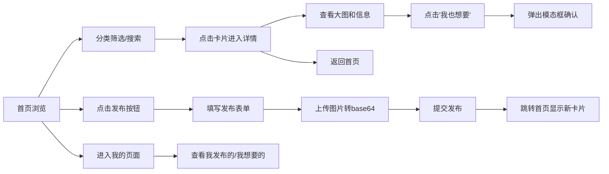

## 1. 产品概述

小区邻里植物交换平台，让小区居民能够便捷地交换闲置植物、园艺工具等，促进邻里交流，践行绿色生活。目标用户为小区内的植物爱好者，核心价值是提供一个轻量、友好的本地植物交换社区。

## 2. 核心功能

### 2.1 用户角色
无需注册登录，使用localStorage本地存储用户发布和收藏的数据。

| 角色 | 注册方式 | 核心权限 |
|------|----------|----------|
| 普通用户 | 无需注册，本地存储 | 浏览植物、发布植物、查看详情、标记想要 |

### 2.2 功能模块
1. **首页**：瀑布流卡片墙、分类筛选（多肉/绿植/花卉/工具）、搜索框
2. **发布页**：表单填写植物信息、多图上传、提交发布
3. **详情页**：大图展示、详细信息、发布人信息、"我也想要"模态框
4. **我的页面**：两栏布局（我发布的 / 我想要的）

### 2.3 页面详情

| 页面名称 | 模块名称 | 功能描述 |
|----------|----------|----------|
| 首页 | 顶部导航 | Logo、分类筛选标签、搜索框、发布/我的入口 |
| 首页 | 瀑布流卡片墙 | 展示所有植物卡片，支持响应式多列布局 |
| 首页 | 植物卡片 | 封面图、植物名称、发布时间、小区定位、分类标签 |
| 发布页 | 发布表单 | 植物名称、品种、分类、描述、图片上传、想换什么、联系方式 |
| 详情页 | 大图轮播 | 多张图片放大展示 |
| 详情页 | 信息展示 | 植物详情、发布人信息、小区定位 |
| 详情页 | 交换模态框 | 点击"我也想要"弹出确认框，显示联系方式 |
| 我的页面 | 两栏布局 | 左侧我发布的植物列表，右侧我想要的植物列表 |

## 3. 核心流程

用户进入首页浏览植物卡片 → 通过分类筛选或搜索找到感兴趣的植物 → 点击卡片进入详情页 → 查看大图和详细信息 → 点击"我也想要"弹出模态框确认交换意向 → 也可以点击发布按钮填写表单发布自己的植物 → 在我的页面管理自己发布和想要的植物。

## 4. 用户界面设计

### 4.1 设计风格
- **主色调**：米白色背景 (#FAF7F2)，墨绿色点缀 (#2D5A3D)
- **辅助色**：浅米色 (#F5F0E8)，苔藓绿 (#4A7C59)，暖棕色 (#8B7355)
- **按钮样式**：大圆角 (16px)，墨绿填充白色文字，hover有轻微阴影
- **卡片样式**：大圆角 (20px)，米白背景，轻微阴影，hover微微上浮
- **字体**：使用"Noto Serif SC"或"ZCOOL XiaoWei"等有手写感的中文字体，营造日系手账氛围
- **布局**：卡片式布局，充足留白，柔和的阴影和边框
- **图标风格**：线性简约图标，配合小贴纸/胶带装饰元素

### 4.2 页面设计概述

| 页面名称 | 模块名称 | UI 元素 |
|----------|----------|----------|
| 首页 | 顶部导航 | 米白底、墨绿文字、圆角搜索框、贴纸装饰 |
| 首页 | 分类标签 | 胶囊形状、选中态墨绿填充、未选中浅灰边框 |
| 首页 | 瀑布流卡片 | 圆角20px、图片圆角顶部、底部信息区米白底 |
| 发布页 | 表单 | 大圆角输入框、浅绿色focus边框、上传区域虚线框 |
| 详情页 | 大图区 | 圆角24px、左右切换箭头、点点指示器 |
| 详情页 | 模态框 | 半透明遮罩、圆角20px卡片、居中显示 |
| 我的页面 | 两栏布局 | 左右分隔、各自卡片列表、浅灰色分界线 |

### 4.3 响应式
- 桌面端优先，瀑布流3-4列
- 平板端2列
- 移动端单列，导航栏简化
- 所有交互元素支持触控操作

### 4.4 装饰元素
- 卡片角落添加小胶带/贴纸装饰
- 分类标签配合小图标（多肉🌵、绿植🌿、花卉🌸、工具🧰）
- 空状态添加可爱的手绘风插画提示
- 按钮hover有轻微弹性动画
