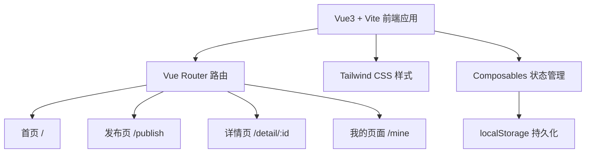
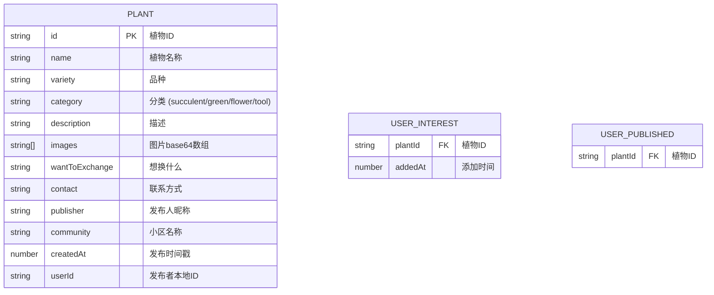

## 1. 架构设计



## 2. 技术描述

- **前端框架**：Vue 3.4 + TypeScript + Vite 5
- **路由管理**：Vue Router 4
- **样式方案**：Tailwind CSS 3
- **状态管理**：Vue Composables (Composition API)
- **数据存储**：浏览器 localStorage
- **构建工具**：Vite 5
- **包管理器**：npm (Windows 环境)

## 3. 路由定义

| 路由 | 页面 | 用途 |
|------|------|------|
| `/` | 首页 Home.vue | 瀑布流展示所有植物，分类筛选、搜索 |
| `/publish` | 发布页 Publish.vue | 表单发布新植物，图片上传 |
| `/detail/:id` | 详情页 Detail.vue | 展示植物详情，大图轮播，交换模态框 |
| `/mine` | 我的页面 Mine.vue | 两栏展示我发布的和我想要的植物 |

## 4. 数据模型

### 4.1 数据模型定义



### 4.2 localStorage 存储结构

- `plant_exchange_plants`: 所有植物列表 JSON 数组
- `plant_exchange_user_id`: 当前用户唯一标识 (UUID)
- `plant_exchange_interested`: 用户"想要"的植物ID数组
- `plant_exchange_published`: 用户发布的植物ID数组

## 5. 项目目录结构

```
project81/
├── src/
│   ├── components/          # 公共组件
│   │   ├── PlantCard.vue    # 植物卡片组件
│   │   ├── ImageUpload.vue  # 图片上传组件
│   │   ├── Modal.vue        # 模态框组件
│   │   └── NavBar.vue       # 导航栏组件
│   ├── composables/         # 组合式函数
│   │   ├── usePlants.ts     # 植物数据管理
│   │   └── useUser.ts       # 用户数据管理
│   ├── pages/               # 页面组件
│   │   ├── Home.vue         # 首页
│   │   ├── Publish.vue      # 发布页
│   │   ├── Detail.vue       # 详情页
│   │   └── Mine.vue         # 我的页面
│   ├── types/               # TypeScript 类型
│   │   └── index.ts
│   ├── utils/               # 工具函数
│   │   ├── storage.ts       # localStorage 封装
│   │   └── image.ts         # 图片处理工具
│   ├── App.vue              # 根组件
│   ├── main.ts              # 入口文件
│   ├── router.ts            # 路由配置
│   └── style.css            # 全局样式
├── index.html
├── vite.config.ts
├── tailwind.config.js
├── postcss.config.js
├── tsconfig.json
└── package.json
```

## 6. 核心功能实现要点

### 6.1 图片上传处理
- 使用 `FileReader` 将图片转为 base64
- 单张图片限制 2MB，总大小不超过 5MB
- 支持预览和删除已上传图片
- 支持拖拽上传

### 6.2 瀑布流布局
- CSS Grid + column-count 实现响应式瀑布流
- 桌面端 3-4 列，平板 2 列，移动端 1 列
- 图片等比缩放，保持卡片高度自然

### 6.3 分类筛选与搜索
- 分类：多肉 (succulent)、绿植 (green)、花卉 (flower)、工具 (tool)
- 搜索支持植物名称、品种、描述模糊匹配
- 分类与搜索可组合使用

### 6.4 数据初始化
- 首次访问时自动生成 mock 数据（5-8条示例植物）
- 数据包含各种分类，便于演示功能
- 自动生成用户唯一标识

## 7. 工具函数

### storage.ts
- `getItem<T>(key: string): T | null`
- `setItem<T>(key: string, value: T): void`
- `removeItem(key: string): void`

### image.ts
- `fileToBase64(file: File): Promise<string>`
- `compressImage(base64: string, maxSize: number): Promise<string>`
- `validateImageSize(file: File, maxMB: number): boolean`
